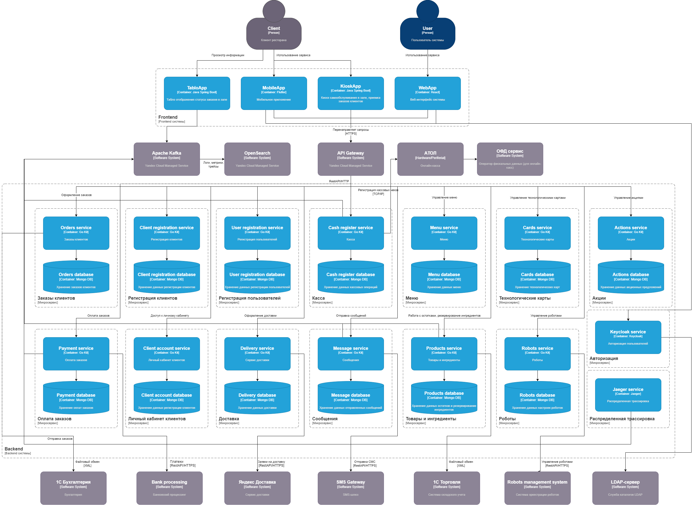

# Компонентная архитектура

## Обоснование выбора архитектурного стиля

Для разработки приложения для автоматизированного ресторана быстрого питания, включающего мобильные устройства и киоски самообслуживания, можно рассмотреть несколько архитектурных стилей. Наиболее подходящим является микросервисная архитектура. Давайте обоснуем этот выбор.

Основные причины выбора микросервисной архитектуры:

**Масштабируемость и гибкость:**

Горизонтальное масштабирование: Микросервисы можно масштабировать независимо друг от друга в зависимости от нагрузки на конкретный компонент системы. Например, модуль обработки заказов может быть масштабирован отдельно от модуля управления меню. Изменение и добавление функциональности: Изменения в одном микросервисе не затрагивают другие, что упрощает внедрение новых функций и исправление ошибок.

**Разделение ответственности:**

Каждый микросервис выполняет строго определённую задачу (например, обработка заказов, управление меню, аутентификация пользователей), что упрощает разработку и поддержку кода. Облегчается поддержка кода, так как каждый сервис может разрабатываться и поддерживаться отдельной командой, обладающей специфическими знаниями и навыками.

**Независимость в выборе технологий:**

Можно использовать различные технологии и языки программирования для каждого микросервиса в зависимости от его требований и оптимальности.
Например, можно использовать Python для сервисов, связанных с машинным обучением (например, рекомендации блюд), и Node.js для сервисов, требующих высокой производительности и низкой задержки (например, обработка заказов в реальном времени).

**Устойчивость и отказоустойчивость:**

Отказ одного микросервиса не приводит к полной остановке системы, что критически важно для бизнеса быстрого питания. Микросервисы могут быть развернуты в разных зонах доступности или даже в разных дата-центрах для повышения отказоустойчивости.

**Лёгкость интеграции и взаимодействия:**

Микросервисная архитектура обычно строится на основе REST API или gRPC, что упрощает взаимодействие между различными компонентами системы и интеграцию с внешними сервисами (например, платёжными шлюзами, сервисами доставки).

Микросервисная архитектура является оптимальным выбором для разработки приложения для автоматизированного ресторана быстрого питания. Она обеспечивает масштабируемость, гибкость, отказоустойчивость и лёгкость интеграции, что критически важно для успешного функционирования и развития такого приложения.

## Диаграмма компонентов

На диаграмме представлены компоненты микросервисной архитектуры системы и интеграции между данными компонентами.

## Перечень интеграций

| № | Внешняя система | Способ интеграционного взаимодействия |
| --- | --- | --- |
| 1 | 1С Бухгалтерия | Обмен файлами XML |
| 2 | Процессинг банка | Rest API/HTTPS |
| 3 | СМС шлюз | Rest API/HTTPS |

## Схема и описание интеграций

