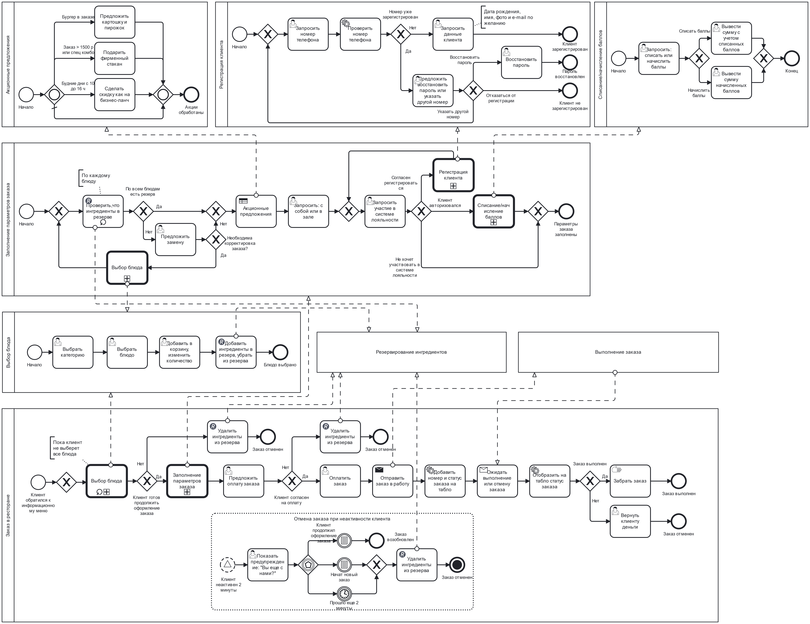

# Компонентная архитектура

## Обоснование выбора архитектурного стиля

Микросервисная архитектура является эффективным подходом для разработки приложений, которые должны масштабироваться и быть гибкими в изменении. В случае приложения для оформления заказов, микросервисная архитектура может предоставить следующие преимущества:

Гибкость: Микросервисы могут быть разработаны и развернуты независимо друг от друга, что позволяет быстро вносить изменения в приложение без необходимости перезапуска всего приложения.

Масштабируемость: Микросервисы могут быть масштабированы отдельно друг от друга, что позволяет легко управлять нагрузкой на приложение и обеспечивать высокую доступность.

Устойчивость: Если один из микросервисов не работает, остальные микросервисы могут продолжать работу, что обеспечивает устойчивость приложения в целом.

Легкость разработки: Разработчики могут работать над отдельными микросервисами, что упрощает процесс разработки и тестирования.

Легкость внедрения новых функций: Новые функции могут быть добавлены в виде новых микросервисов, что позволяет быстро внедрять новые возможности в приложение.

## Диаграмма компонентов

На диаграмме представлены компоненты микросервисной архитектуры системы и интеграции между данными компонентами.

## Перечень интеграций

| № | Внешняя система | Способ интеграционного взаимодействия |
| --- | --- | --- |
| 1 | 1С Бухгалтерия | Обмен файлами XML |
| 2 | Процессинг банка | Rest API/HTTPS |
| 3 | СМС шлюз | Rest API/HTTPS |

## Схема и описание интеграций

