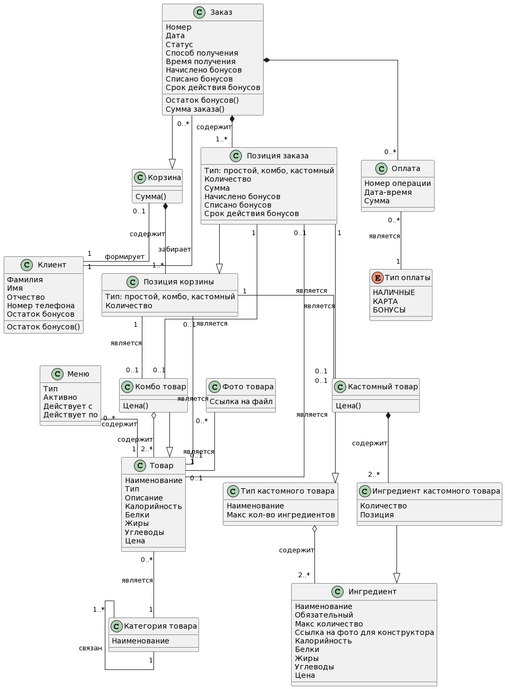

# Информационная модель

## Предметная область

В рамках MVP проекта были выделены основные сущности с атрибутами и определены связи между ними.

Базовыми сущностями являются:

- Клиент
- Заказ
- Корзина
- Меню
- Товар
- Позиция корзины
- Позиция заказа
- Оплата

## Диаграмма классов

Пояснения по производным классам:

- Комбо товар наследует класс Товар, а также агрегирует его, то есть из нескольких товаров собирается комбо-товар.

- Тип кастомного товара агрегирует Ингредиенты, является рецептом, по которому Клиент может собрать свой "неповторимый" кастомный товар, например свой комбо-бургер или салат.

- Ингредиент кастомного товара наследует класс Ингредиент и расширяет его атрибутами, применимыми для конкретного кастомного товара, собранного клиентом. 

- Кастомный товар наследует класс Тип кастомного товара и является композицией Ингредиентов кастомного товара. Это конкретный товар, собранный конкретным клиентом и присутствующий в конкретном заказе.

- Класс категория товара имеет ассоциативную связь на себя, что используется для связанных категорий товаров, например, при заказе десерта хочу выводить 1-3 вида кофе или чай, для быстрого перехода к конкретным товарам или в категорию.

- Корзина вынесена в отдельный класс, для одного клиента может существовать только одна корзина.

- Заказ наследует класс Корзина и расширяет его набором дополнительных атрибутов.

- Позиция заказа наследует класс Позиция корзины.
