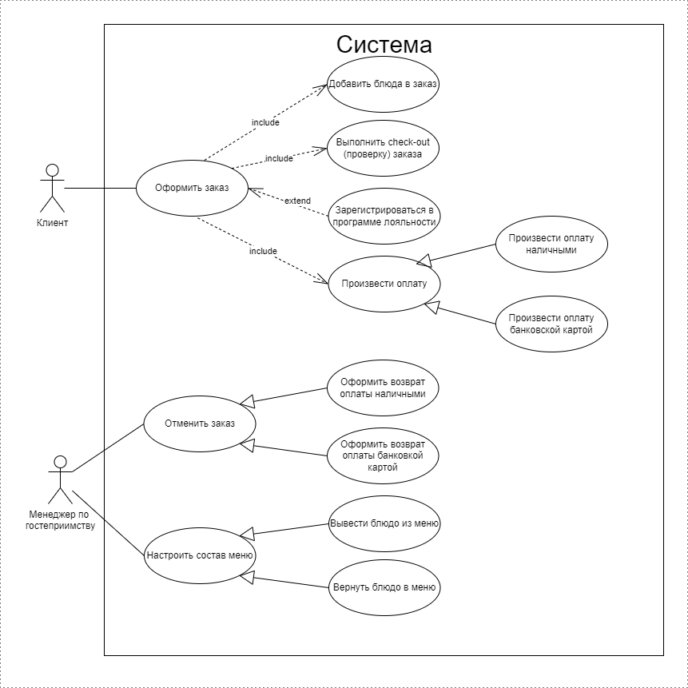

# Требования к системе

## Требования к системе в целом

### Производительность

**`NRQ-PER01`** Система должна обрабатывать не менее 600 заказов в час.  

**`NRQ-PER02`** Время отклика системы на запросы пользователей через элементы интерфейса - не более 1 с (в 95% обращений пользователей к системе).

### Масштабируемость

**`NRQ-SCA01`** В отсутствие пиковых нагрузок для равномерного распределения нагрузки на роботов разных роботизированных линий эти линии работают попеременно.  

**`NRQ-SCA02`** Во время пиковых нагрузок система должна автоматически включать роботов второй линии, при снижении нагрузки система должна автоматически отключать роботов второй линии.

### Доступность

**`NRQ-AVA01`** Система должна работать в режиме 24 на 7 (за исключением обязательного регламентного перерыва 2 часа ежедневно на санитарную обработку).  

**`NRQ-AVA02`** Доступность системы - 99,4%  (соответствует простою системы не более 8м 38с в сутки) (без учета регламентных перерывов).  

**`NRQ-AVA03`** Резервирование обеспечивается двумя роботизированными линиями, включающими одинаковый набор роботов. В случае выхода из строя одного или нескольких роботов одного типа в процессе обработки заказов участвуют роботы другой линии.  

### Надежность

**`NRQ-REL01`** Если соединение между пользователем и системой разрывается до того, как заказ подтвержден или отменен, система должна позволять пользователю восстановить незавершенный заказ и продолжить работу.  

### Безопасность

**`NRQ-SEC01`** Система должна предусматривать аутентификацию пользователей в системе по номеру телефона и паролю.  

**`NRQ-SEC02`** При оформлении заказов через мобильное приложение пользователи должны обязательно аутентифицироваться.  

**`NRQ-SEC03`** Система должна позволять пользователям просматривать только заказы, оформленные ими лично, но не другими пользователями.  

**`NRQ-SEC04`** При работе с персональными данными пользователей система должна соответствовать требованиям ФЗ № 152 “О персональных данных».  

### Совместимость

**`NRQ-COM01`** Мобильное приложение должно быть совместимо с ОС Android 11.0 или выше и iOS 15.0 или выше. 

**`NRQ-COM02`** Приложение для киосков самообслуживания должно работать по крайней мере на ОС следующих версий: Ubuntu Linux 2004 LTS - 2204 LTS. 

### Особенности хранения данных

**`NRQ-DAT01`** Данные в системе должны быть доступны не менее 3 лет.  

**`NRQ-DAT02`** В системе должна быть предусмотрена возможность архивации и восстановления данных из архива за заданный период.  

**`NRQ-DAT03`** Полное резервное копирование БД должны производиться ежедневно.  

**`NRQ-DAT04`** Резервное копирование изменений БД с момента последнего полного резервного копирования должно производиться каждые 30 минут.    

**`NRQ-DAT05`** Резервные копии БД должны храниться 7 дней с момента создания.

### Удобство использования

**`NRQ-USA01`** Дизайн UI элементов системы должен соответствовать корпоративному брендбуку.   

**`NRQ-USA02`** Интерфейс системы должен быть на русском и английском языках.  

## Требования к функциям, выполняемым системой

### Диаграмма Use Case

### Описание Use Case, реализуемых в рамках MVP

#### Use Case “Оформить заказ”

|  | Описывается сценарий оформления заказа |
| --- | --- |
| Область действия | Клиент - система |
| Основной актор | Клиент |
| Участники и интересы | Клиент получает услугу получения заказа, состоящего из выбранных клиентом блюд |
| Предусловие | Клиент начал работу с терминалом самообслуживания в зале или зашел в мобильное приложение |
| Минимальные гарантии | нет |
| Результат | Клиент оформил заказ в ресторане |
| Basic flow | 1. Система выполняет Use Case “Добавить блюда в заказ” 2. Система выполняет Use Case “Заполнить параметры заказа” 3. Система выводит сумму списанных (или начисленных) баллов, сумму заказа к оплате и запрос способа оплаты: наличными или картой или отмены заказа. 4. Клиент нажимает Оплата картой. 5. Система выполняет Use Case “Произвести оплату банковской картой” **Конец сценария** |
| Alternate flow | 4a Клиент хочет оплатить наличными 4a1 Клиент нажимает Оплата наличными. 4a2 Система выполняет Use Case “Произвести оплату наличными” 4b  Клиент отказывается оплачивать заказ 4b1 Клиент нажимает Отменить. 4b2 Система удаляет заказ, ингредиенты из резерва и отображает стартовый экран |
| Exceptional Flow |  |

#### Use Case “Добавить блюда в заказ”

|  | Описывается сценарий добавления блюд в заказ |
| --- | --- |
| Область действия | Клиент - система |
| Основной актор | Клиент |
| Участники и интересы | Клиент получает услугу получения заказа, состоящего из выбранных клиентом блюд |
| Предусловие | Клиент начал работу с терминалом самообслуживания в зале или зашел в мобильное приложение и находится на стартовом экране |
| Минимальные гарантии | нет |
| Результат | Клиент сформировал список блюд в корзине для дальнейшего оформления заказа в ресторане |
| Basic flow | 1. Система отображает стартовый экран с категориями блюд 2. Клиент выбирает категорию. 3. Система отображает блюда категории. 4. Клиент выбирает блюдо, вводит количество и нажимает кнопку Добавить в корзину. 5. Система добавляет блюдо в корзину, добавляет ингредиенты в резерв и отображает сумму заказа. 6. Клиент нажимает Оформить заказ. **Конец сценария** |
| Alternate flow | 6а Клиент хочет добавить еще одно блюдо: 6а1 Клиент нажимает Добавить. 6a2 Возврат на шаг 1 6b Клиент отказывается продолжать заказ   6b1 Клиент нажимает Отменить.   6b2 Система удаляет ингредиенты из резерва и отображает стартовый экран **Конец сценария** |
| Exceptional Flow |  |

#### Use Case “Заполнить параметры заказа”

|  | Описывается сценарий заполнения параметров заказа |
| --- | --- |
| Область действия | Клиент - система |
| Основной актор | Клиент |
| Участники и интересы | Клиент получает услугу получения заказа, состоящего из выбранных клиентом блюд |
| Предусловие | Клиент сформировал список блюд в корзине в терминале самообслуживания в зале или в мобильном приложении и нажал кнопку Оформить заказ |
| Минимальные гарантии | нет |
| Результат | Клиент заполнил параметры заказа, система вывела окончательную сумму к оплате с учетом акций и бонусов |
| Basic flow | 1. Система проверяет наличие всех необходимых для выполнения заказа ингредиентов. 2. Система проверяет применимость акционных предложений, которые можно применить к данному заказу.  и выводит экран с вариантами акционных предложений, которые можно применить к данному заказу (если есть). 3. Клиент соглашается с предложенными акционными предложениями или не выбирает ни одно и нажимает Дальше. 4. Система применяет акционные предложение к заказу (если есть) и выводит запрос: “В зале, на вынос?” 5. Клиент делает выбор. 6. Система выводит список заказа с суммой заказа. 7. Клиент нажимает Дальше. 8. Система предлагает ввести данные об участии программе лояльности: - отсканировать штрихкод виртуальной карты - ввести номер телефона - зарегистрироваться в системе - продолжить без авторизации 9. Клиент авторизуется предъявлением штрих-кода или вводом номера телефона 10. Система предлагает списать или начислить бонусы 11. Клиент делает выбор. **Конец сценария** |
| Alternate flow | 1а Не для всех блюд зарезервированы ингредиенты 1a1 Система удаляет такие позиции из заказа и предлагает выбрать блюда взамен отсутствующих или продолжить без добавления блюд 1a2 Клиент соглашается на добавление блюд 1a3 Система выполняет Use Case “Добавить блюда в заказ” 1a2a Клиент продолжает без добавления блюд 1a2a1 Переход на шаг 2 2а Для данного заказа не подходит ни одно акционное предложение 2a1 Переход на шаг 4 7a  Клиент отказывается оплачивать заказ 7a1 Клиент нажимает Отменить. 7a2 Система удаляет заказ, ингредиенты из резерва и отображает стартовый экран **Конец сценария** 9a Клиент хочет зарегистрироваться в программе лояльности 9а1 Клиент нажимает Зарегистрироваться. 9a2 Система производит регистрацию клиента (Use Case “Зарегистрироваться в программе лояльности”) 9a3 Возврат на шаг 8 9b Клиент хочет продолжить без авторизации 9b1 Клиент нажимает Продолжить без авторизации **Конец сценария** |
| Exceptional Flow |  |

#### Use Case “Произвести оплату наличными”

|  | Описывается сценарий оплаты заказа наличными |
| --- | --- |
| Область действия | Клиент - система |
| Основной актор | Клиент |
| Участники и интересы | Клиент оплачивает заказ наличными, потому что ему так удобнее, Менеджер по гостеприимству (Администратор) принимает деньги у клиента, печатает клиенту кассовый чек и талон с номером заказа, изменяет статус заказа на В работе. |
| Предусловие | Клиент выбрал Оплата наличными при оформлении заказа в терминале самообслуживания в зале или в мобильном приложении, клиент должен быть авторизован при оформлении заказа в мобильном приложении. |
| Минимальные гарантии | нет |
| Результат | Клиент оплатил заказ наличными |
| Basic flow | 1. Система создает заказ со статусом Ожидает оплаты, выводит сообщение: “Вы можете оплатить заказ администратору, предъявив талон с номером, заказ действителен в течение 30 минут” и печатает талон с номером заказа (только при заказе через терминал самообслуживания) или выводит сообщение: “Вы можете оплатить заказ администратору, предъявив номер заказа из СМС, заказ действителен в течение 30 минут” и отправляет СМС с номером заказа (только при заказе через мобильное приложение). 2. Клиент предъявляет администратору талон или СМС с номером заказа. 3. Администратор переходит в раздел Заказы 4. Система отображает заказы клиентов 5. Администратор находит заказ клиента, принимает у клиента наличные деньги, изменяет статус заказа на Оплачен. 6. Система оформляет клиенту кассовый чек, печатает талон с номером заказа, изменяет статус заказа на В работе, добавляет номер и статус заказа на информационном табло. **Конец сценария** |
| Alternate flow | 2а Клиент не предъявил администратору талон или СМС с номером заказа в течение 30 минут 2a1 Система удаляет заказ и ингредиенты из резерва **Конец сценария** 5a Клиент не произвел оплату заказа Администратору 5a1 Система удаляет заказ и ингредиенты из резерва **Конец сценария** |
| Exceptional Flow | 6a Сбой при оформлении кассового чека 6a1 Система изменяет стату заказа на Ожидает оплаты, выводит сообщение об ошибке и предлагает повторить попытку оформления кассового чека, оплатить банковкой картой на терминале самообслуживания или в мобильном приложении или отменить заказ 6a2 Возврат на шаг 3 6a1a Клиент соглашается оплатить банковской картой в мобильном приложении 6a1a1 Администратор возвращает клиенту деньги 6a1a2 Клиент авторизуется в мобильном приложении, выбирает неоплаченый заказ и нажимает оплатить. 6a1a3 Система выполняет Use Case “Произвести оплату банковской картой” **Конец сценария**  6a1b Клиент соглашается оплатить банковской картой через терминал самообслуживания 6a1b1 Администратор возвращает клиенту деньги и авторизуется в терминале самообслуживания 6a1b2 Система отображает дополнительные пункты меню. 6a1b3 Администратор заходит в раздел Заказы 6a1b4 Система отображает заказы клиентов 6a1b5 Администратор находит и открывает заказ клиента и нажимает Оплатить. 6a1b6 Система выполняет Use Case “Произвести оплату банковской картой” **Конец сценария** 6a1c Клиент отказывается от оплаты 6a1c1 Администратор возвращает клиенту деньги и нажимает Удалить рядом с заказом. 6a1c2 Система удаляет заказ и ингредиенты из резерва. **Конец сценария** |

### Описание UseCase, реализуемых в рамках релиза 1

#### Use Case “Зарегистрироваться в программе лояльности”

|  | Описывается сценарий регистрации клиента в программе лояльности |
| --- | --- |
| Область действия | Клиент - система |
| Основной актор | Клиент |
| Участники и интересы | Клиент получает регистрируется в программе лояльности для возможности получения скидок на заказы. |
| Предусловие | Клиент выбрал Регистрацию в системе при оформлении заказа в терминале самообслуживания в зале или в мобильном приложении |
| Минимальные гарантии | нет |
| Результат | Клиент зарегистрировался с программе лояльности |
| Basic flow | 1. Система запрашивает номер телефона 2. Клиент вводит номер телефона 3. Система проверяет номер телефона и запрашивает данные клиента: дата рождения, имя, фото (только мобильное приложение), e-mail (не обязательное поле) 4. Клиент вводит запрощенные данные 5. Система проверяет введенные данные на корректность, сохраняет данные клиента в базе данных и выводит сообщение: Клиент зарегистрирован **Конец сценария** |
| Alternate flow | 3а Номер уже зарегистрирован 3a1 Система предлагает клиенту восстановить пароль, указать другой номер телефона или отказаться от регистрации 3a2 Клиент выбирает Восстановить пароль 3a3 Система высылает клиенту СМС в новым паролем **Конец сценария** 3а2a Клиент выбирает Указать другой номер 3a2a1 Возврат на шаг 1 3а2a Клиент выбирает Отказаться от регистрации **Конец сценария** |
| Exceptional Flow |  |

#### Use Case “Произвести оплату банковской картой”

|  | Описывается сценарий оплаты заказа банковской картой |
| --- | --- |
| Область действия | Клиент - система |
| Основной актор | Клиент |
| Участники и интересы | Клиент оплачивает заказ банковской картой, потому что ему так удобнее |
| Предусловие | Клиент выбрал Оплата банковской картой при оформлении заказа в терминале самообслуживания в зале или в мобильном приложении, клиент должен быть авторизован при оформлении заказа в мобильном приложении. |
| Минимальные гарантии | нет |
| Результат | Клиент оплатил заказ банковской картой |
| Basic flow | 1. Система выводит сообщение, что клиент может оплатить заказ через терминал или с привязанной карты в мобильном приложении. 2. Клиент оплачивает заказ через терминал или в мобильном приложении через привязанную карту. 3. Система отображает на экране и печатает талон с номером заказа (только при заказе через терминал самообслуживания), отправляет заказ в работу (статус В работе), добавляет номер и статус заказа на информационном табло и отправляет СМС с номером заказа (только при заказе через мобильное приложение). **Конец сценария** |
| Alternate flow | нет |
| Exceptional Flow | 2а Во время оплаты происходит сбой (нет связи, недостаточно средств, карта заблокирована и т.д.) 2a1 Система выводит сообщение об ошибке и предлагает повторить оплату банковкой картой, наличными или отменить заказ 2a2 Возврат на шаг 2 2a2a Клиент решает оплатить наличными 2a2a1 Клиент нажимает Оплата наличными. 2a2a2 Система выполняет (Use Case “Произвести оплату наличными”) **Конец сценария** 2a2b Клиент отказывается от оплаты 2a2b1 Клиент нажимает Отменить 2a2b2 Система удаляет заказ, ингредиенты из резерва и отображает стартовый экран **Конец сценария** |