# Пользовательский интерфейс приложения

## Макет пользовательского интерфейса

Макет пользовательского интерфейса мобильного приложения представлен в виде вайрфреймов экранов.

Кликабельный прототип доступен по [ссылке](https://www.figma.com/proto/EeiYHaDGD1GDfz0oWJ3OlM/%D0%A0%D0%BE%D0%B1%D0%BE%D1%82-%D0%B8-%D1%82%D0%BE%D1%87%D0%BA%D0%B0?type=design&node-id=2-2&t=1r8GOvfBGksf5gAp-1&scaling=scale-down&page-id=0%3A1&starting-point-node-id=2%3A52&mode=design)

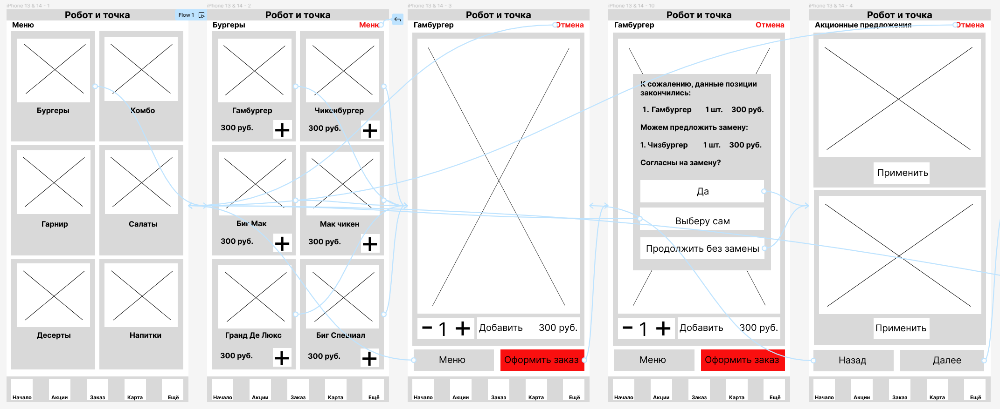
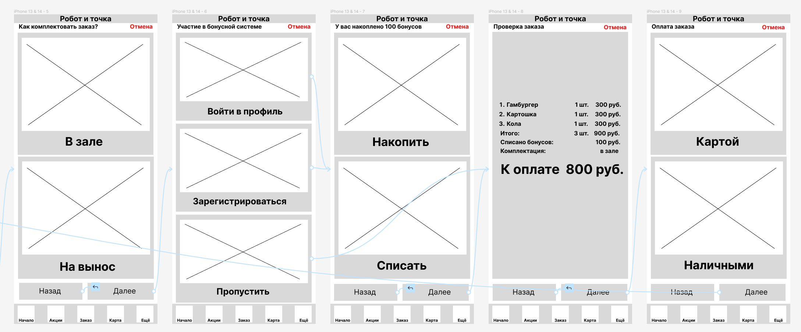

## Описание взаимодействия с API

Сценарий оформления заказа

Предусловие: Клиент зашел в мобильное приложение

| № | Шаги | Макет |
| --- | --- | --- |
| 1 | Приложение отправляет запрос GET /menu/default?view=cathegory на сервер, получает список категорий и отрисовывает их на форме |  |
| 2 | Клиент выбирает категорию |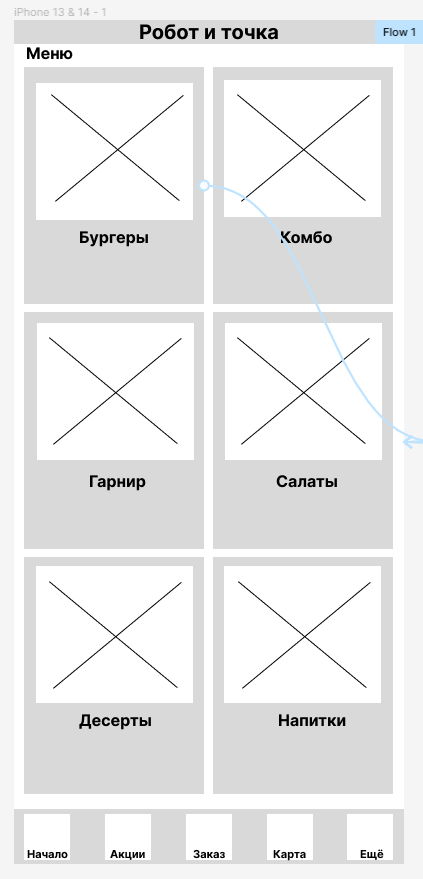  |
| 3 | Приложение отправляет запрос GET /menu/default?view=dishes&cathegory={cathegory_id} на сервер, получает список блюд и отрисовывает их на форме|  |
| 4 | Клиент выбирает блюдо |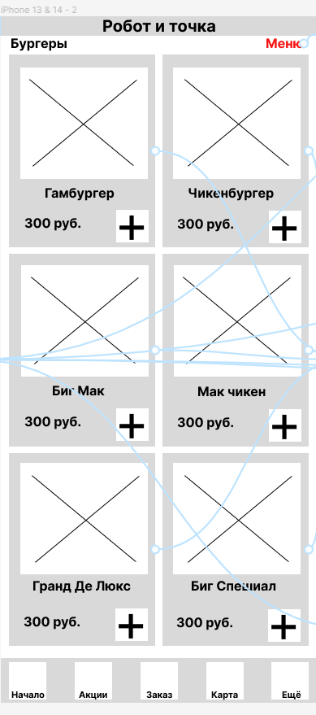  |
| 5 | Приложение отправляет запрос GET /menu/default?view=dishes&dish={dish_id} на сервер, получает информацию по блюду и отрисовывает ее на форме |  |
| 6 | Клиент изменяет количество и нажимает кнопку “Оформить заказ” Альтернативный сценарий: клиент нажимает кнопку “Меню”, выполняется возврат на шаг 1 |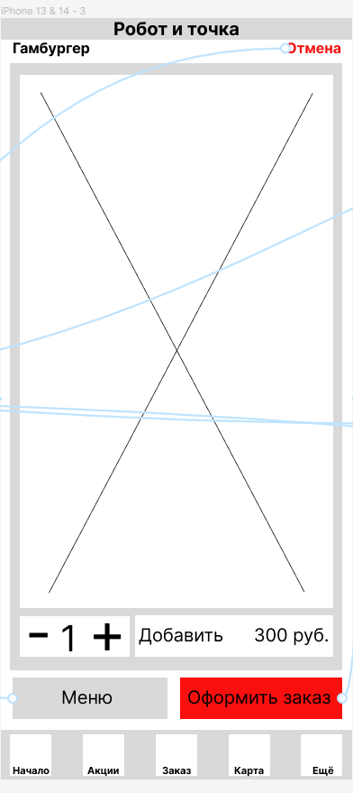 |
| 7 | Приложение отправляет запрос POST /orders на сервер, новый заказ сохраняется в базе данных на сервере |  |
| 8 | Система проверяет наличие всех необходимых для выполнения заказа ингредиентов. Не для всех блюд зарезервированы ингредиенты. Система удаляет такие позиции из заказа и предлагает выбрать блюда взамен отсутствующих или продолжить без добавления блюд |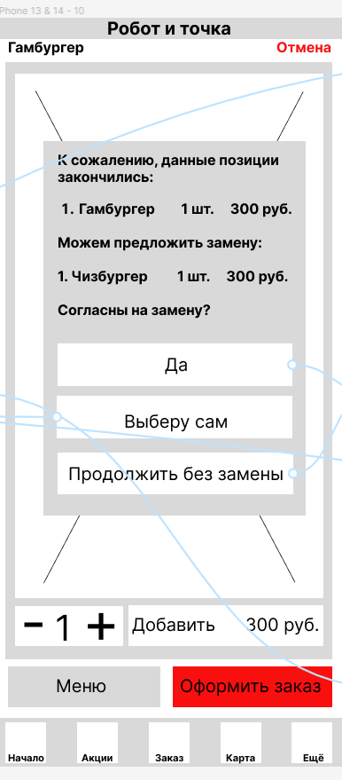 |
| 9 | Приложение отправляет запрос GET /orders/{orderid}/actions на сервер, получает список применимых к заказу акций и  отрисовывает их на форме. Альтернативный сценарий:  Для данного заказа не подходит ни одно акционное предложение|  |
| 10 | Клиент соглашается с предложенными акционными предложениями или не выбирает ни одно и нажимает Дальше | 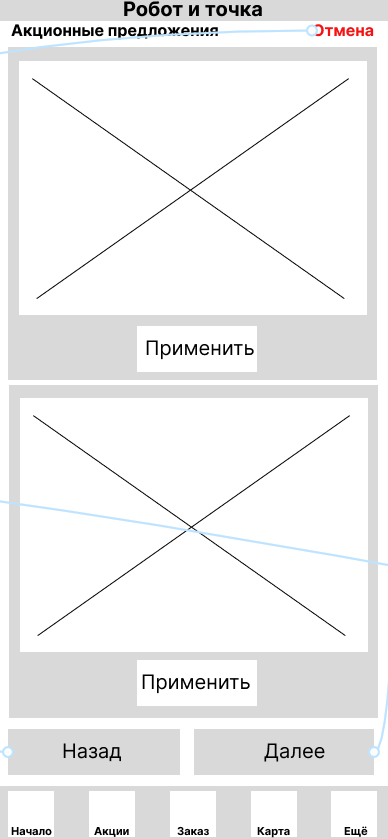  |
| 11 | Приложение отправляет запрос POST /orders/{orderid}/actions/{actionid} на сервер по каждой акции, выбранной клиентом|  |
| 12 | Система применяет акционные предложение к заказу (если есть) и выводит запрос: “В зале, на вынос?” | 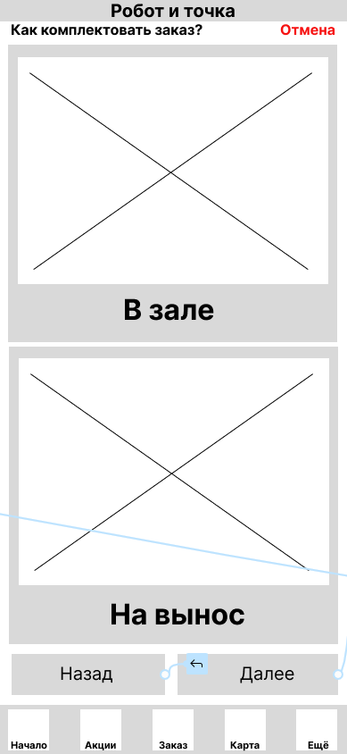 |
| 13 | Клиент делает выбор. |  |
| 14 |  Система предлагает ввести данные об участии программе лояльности: - войти в профиль - зарегистрироваться - пропустить | 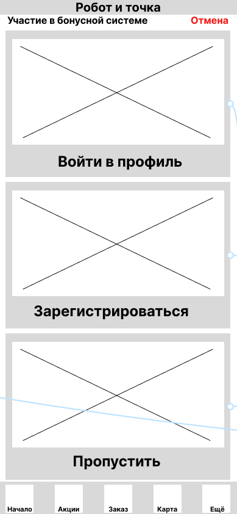 |
| 15 | Клиент делает выбор |  |
| 16 | Система предлагает списать или начислить бонусы | 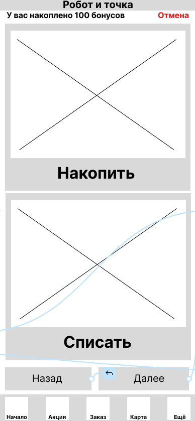 |
| 17 | Клиент делает выбор |  |
| 18 |  Система выводит сумму списанных (или начисленных) баллов, сумму заказа к оплате | 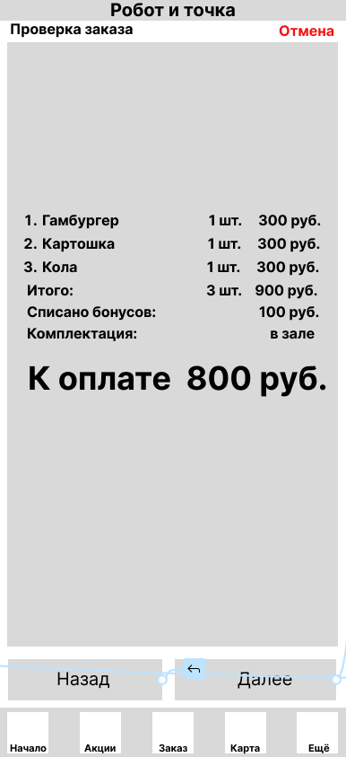 |
| 19 | Клиент нажимает кнопку “Далее” |  |
| 20 | Система запрашивает способ оплаты: наличными или картой. | 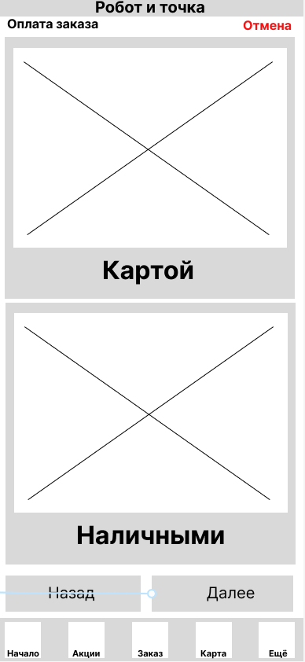 |
| 21 | Клиент делает выбор |  |
| 22 | Приложение отправляет запрос POST /payments на сервер, если клиент выбрал оплату картой, то он переадресуется на страницу процессинга банка. |  |
| 23 | Приложение отправляет запрос PUT /orders/{orderid} на сервер, заказ сохраняется в базе данных с учетом всех введенных параметров заказа |  |